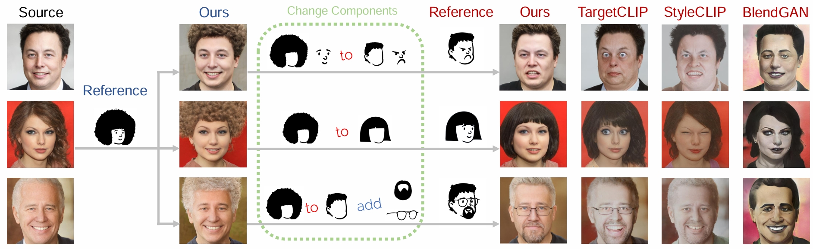

# [ClipFaceShop](https://openaccess.thecvf.com/content/ICCV2023/papers/Zhao_Bring_Clipart_to_Life_ICCV_2023_paper.pdf)



## 

The development of face editing has been boosted since the birth of StyleGAN. Many works have been proposed to help users express their ideas through different interactive methods, such as sketching and exemplar photos. However, they are limited either in expressiveness or generality. We propose a new interaction method by guiding the editing with abstract clipart, composed of a set of simple semantic parts, allowing users to control across face photos with simple clicks. However, this is a challenging task given the large domain gap between colorful face photos and abstract clipart with limited data. To solve this problem, we introduce a framework called ClipFaceShop built on top of StyleGAN. The key idea is to take advantage of $\mathcal{W}+$ latent code encoded rich and disentangled visual features, and create a new lightweight selective feature adaptor to predict a modifiable path toward the target output photo. Since no pairwise labeled data exists for training, we design a set of losses to provide supervision signals for learning the modifiable path. Experimental results show that ClipFaceShop generates realistic and faithful face photos, sharing the same facial attributes as the reference clipart. We demonstrate that ClipFaceShop supports clipart in diverse styles, even in form of a free-hand sketch.

---------------------

We now offer one demo script for one-epoch training at `clipfaceshop-main.py`. And we will be releasing a convenient clipart editor in the future.

You should download some pretrained model weights ( [pretrained StyleGAN2](https://drive.google.com/uc?id=1EM87UquaoQmk17Q8d5kYIAHqu0dkYqdT), [pretrained ArcFace](https://github.com/TreB1eN/InsightFace_Pytorch) ) and move them to `./pretrained_models`. We utilized the pretrained face parsing model of  [CelebAMask-HQ](https://drive.google.com/file/d/1o1m-eT38zNCIFldcRaoWcLvvBtY8S4W3/view?usp=sharing) at the path `./pretrained_models/mask_net.pth` for our face parsing.

Then you can simply follow this command:

```
python clipfaceshop-main.py --target_path ./dirs/targets/example.jpg --output_folder ./output/ --lambda_transfer 1 --weight_decay 5e-5 --lambda_consistency 0.1 --lambda_id 1.5 --lambda_sourcesim 0.3 --lambda_gaps 1 --lambda_background 1e-7 --mpp_d 5  --num_images 3  --lr 0.1
```

to generate results, where `--target_path` is the target clipart path and the results will be saved at `--output_folder`.

You can change the parameters for better results. 

Good luck!

-------------

If you make use of our work, please cite our paper:
```
@InProceedings{Zhao_2023_ICCV,
    author    = {Zhao, Nanxuan and Dang, Shengqi and Lin, Hexun and Shi, Yang and Cao, Nan},
    title     = {Bring Clipart to Life},
    booktitle = {Proceedings of the IEEE/CVF International Conference on Computer Vision (ICCV)},
    month     = {October},
    year      = {2023},
    pages     = {23341-23350}
}
```
We thank [TargetClip](https://github.com/hila-chefer/TargetCLIP), [StyleGAN2](https://github.com/NVlabs/stylegan2) for their excellent works.
